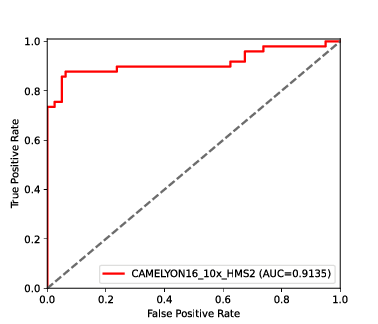

# HMS2

Another annotation-free whole-slide training approach to pathological classification.
This repository provides scripts to reproduce the results in the paper "Deep neural network trained on gigapixel images improves lymph node metastasis detection in clinical settings", including model training, inference, visualization, and statistics calculation, etc.

[>> **Demo Video** <<](https://youtu.be/-z2I0LK_6nc) | [**Journal Link**](https://www.nature.com/ncomms/) | [**Our Website**](https://www.aetherai.com/)

[](https://youtu.be/-z2I0LK_6nc)

## Publications

(To be updated.)

## License

Copyright (C) 2021 aetherAI Co., Ltd. All rights reserved. Licensed under the CC BY-NC-SA 4.0 license (https://creativecommons.org/licenses/by-nc-sa/4.0/legalcode).

## Requirements

### Hardware Requirements

Make sure the system contains adequate amount of main memory space (minimal: 32 GB) to prevent out-of-memory error.

### Software Stacks

Although Poetry can set up most Python packages automatically, you should install the following native libraries manually in advance.

- CUDA 10.2+ (Recommended: 11.3)

CUDA is essential for PyTorch to enable GPU-accelerated deep neural network training. See https://docs.nvidia.com/cuda/cuda-installation-guide-linux/ .

- OpenMPI 3+

OpenMPI is required for multi-GPU distributed training. If `sudo` is available, you can simply install this by,
```
sudo apt install libopenmpi-dev
```

- Python 3.7+

The development kit should be installed.
```
sudo apt install python3-dev
```

- OpenSlide

OpenSlide is a library to read slides. See the installation guide in https://github.com/openslide/openslide .

### Python Packages

We use Poetry to manage Python packages. The environment can be automatically set up by,
```
cd [HMS2 folder]
python3 -m pip install poetry
python3 -m poetry install
python3 -m poetry run poe install-cu113  # change this to "install-cu102" for CUDA 10.x.
```

## Usage

Before initiating a training task, you should prepare several configuration files with the following step-by-step instructions. Refer to `projects/Camelyon16` as an example for training an HMS model on the CAMELYON16(https://camelyon16.grand-challenge.org/) dataset. 

### 0. (Optional) Try a pre-trained CAMELYON16

If you would like to try training HMS models using CAMELYON16 or evaluating pre-trained ones, here we provided contour description files and pre-trained weights trained at 2.5x, 5x, and 10x magnifications, which is available at https://drive.google.com/file/d/12Fv-OhAze_t2_bCX7l1S5iMCgQgOvHGF/view?usp=sharing .

After the ZIP file is downloaded, unzip it to the project folder:
```
unzip -o hms2_camelyon16.zip -d /path/to/hms2
```

Besides, you should prepare the slides of CAMELYON16 from https://camelyon16.grand-challenge.org/ into `projects/Camelyon16/slides`. Then follow the instructions below.

| Pre-trained model | AUC (95% CI)
| ----------------- | ----------------------------------
| Camelyon16_2.5x   | 0.6015 (0.5022-0.7008)
| Camelyon16_5x     | 0.6242 (0.5194-0.7291)
| Camelyon16_10x    | 0.9135 (0.8490-0.9781)



### 1. Create a Project Folder

As a convention, create a project folder in `projects` with four sub-folders, `datalists`, `slides`, `contours`, and `configs`.

### 2. Define Datasets

3 CSV files defining training, validation and testing datasets, respectively, should be placed in `projects/YOUR_PROJECT/datalists`. See `projects/Camelyon16/datalists` for example.

These CSV files should follow the format if your datasets were annotated in slide level:
```
[slide_1_basename],[slide_1_class]
[slide_2_basename],[slide_2_class]
...
```
, where [slide\_name\_\*] specify the filename **without extension** of a slide image and [class\_id\_\*] is an integer indicating a slide-level label (e.g. 0 for normal, 1 for cancerous). 

Given contour-level (e.g. LN-level) labels, construct the CSV files in:
```
[slide_1_contour_1],[slide_1_contour_1_class]
[slide_1_contour_2],[slide_1_contour_2_class]
...
```
You can name each contour whatever you want.

#### (Optional) Contour Description Files

For each contour, a contour description file in JSON should be composed with content like:
```
{"slide\_name": "slide\_1\_basename", "contours": contours}
```
, where `contours` is a list of contour. Each contour is a list of coordinates in (x, y). See `projects/Camelyon16/contours` for example. Save these files in `projects/YOUR_PROJECT/contours`.

### 3. Prepare Slide Files

Place the slides files in `projects/YOUR_PROJECT/slides`. Soft links (`ln -s`) work fine.

### 4. Set Up Training Configurations

Model hyper-parameters are set up in a YAML file. You can copy `projects/Camelyon16/configs/config_2.5x.yaml` and modify it for your own preference. 

The following table describes each field in a config.

| Field                      | Description
| -------------------------- | ---------------------------------------------------------------------------------------------
| RESULT_DIR                 | Directory to store output stuffs, including model weights, testing results, etc.
| MODEL_PATH                 | Path to store the model weight. (default: `${RESULT_DIR}/model.h5`)
| OPTIMIZER_STATE_PATH       | Path to store the state of optimizer. (default: `${RESULT_DIR}/opt_state.pt`)
| STATES_PATH                | Path to store the states for resuming. (default: `${RESULT_DIR}/states.pt`)
| CONFIG_RECORD_PATH         | Path to back up this config file. (default: `${RESULT_DIR}/config.yaml`)
| USE_MIXED_PRECISION        | Whether to enable mixed precision training.
| USE_HMS2                   | Whether to enable HMS2.
| TRAIN_CSV_PATH             | CSV file defining the training dataset.
| VAL_CSV_PATH               | CSV file defining the validation dataset.
| TEST_CSV_PATH              | CSV file defining the testing dataset.
| CONTOUR_DIR                | Directory containing contour description files. Set NULL when using slide-level labels.
| SLIDE_DIR                  | Directory containing all the slide image files (can be soft links).
| SLIDE_FILE_EXTENSION       | File extension. (e.g. ".ndpi", ".svs")
| SLIDE_READER               | Library to read slides. (default: `openslide`)
| RESIZE_RATIO               | Resize ratio for downsampling slide images.
| INPUT_SIZE                 | Size of model inputs in [height, width, channels]. Resized images are padded or cropped to the size. Try decreasing this field when main memory are limited.
| GPU_AUGMENTS               | Augmentations to do on GPU with patch-based affine transformation. (defaults: ["flip", "rigid", "hed_perturb"])
| AUGMENTS                   | Augmentations to do on CPU.
| MODEL                      | Model architecture to use. One of `fixup_resnet50`.
| POOL_USE                   | Global pooling method in ResNet. One of `gmp`, `gap`, and `lse`.
| NUM_CLASSES                | Number of classes.
| BATCH_SIZE                 | Number of slides processed in each training iteration for each MPI worker. (default: 1)
| EPOCHS                     | Maximal number of training epochs.
| LOSS                       | Loss to use. One of `ce`.
| METRIC_LIST                | A list of metrics.
| OPTIMIZER                  | Optimizer for model updating. 
| INIT_LEARNING_RATE         | Initial learning rate for Adam optimizer.
| REDUCE_LR_FACTOR           | The learning rate will be decreased by this factor upon no validation loss improvement in consequent epochs.
| REDUCE_LR_PATIENCE         | Number of consequent epochs to reduce learning rate.
| TIME_RECORD_PATH           | Path to store a CSV file recording per-iteration training time.
| TEST_TIME_RECORD_PATH      | Path to store a CSV file recording per-iteration inference time.
| TEST_RESULT_PATH           | Path to store the model predictions after testing in a JSON format. (default: `${RESULT_DIR}/test_result.json`)
| VIZ_RESIZE_RATIO           | The resized ratio of the prediction maps.
| VIZ_FOLDER                 | Folder to store prediction maps. (default: `${RESULT_DIR}/viz`)
| VIZ_RAW_FOLDER             | Folder to store raw prediction maps. (default: `${RESULT_DIR}/viz_raw`)

### 5. Train a Model

To train a model, simply run
```
python3 -m poetry run python -m hms2.pipeline.train --config YOUR_TRAIN_CONFIG.YAML [--continue_mode]
```
, where `--continue_mode` is optional that makes the training process begin after loading the model weights.

To enable multi-node, multi-GPU distributed training, simply add `mpirun` in front of the above command, e.g.
```
mpirun -np 4 -x CUDA_VISIBLE_DEVICES="0,1,2,3" python3 -m poetry run python -m hms2.pipeline.train --config YOUR_TRAIN_CONFIG.YAML
```

Typically, this step takes days to complete, depending on the computing power, while you can trace the progress in real time from program output.

### 6. Evaluate the Model

To evaluate the model, call
```
[mpirun ...] python3 -m poetry run python -m hms2.pipeline.test --config YOUR_TRAIN_CONFIG.YAML
```

This command will generate a JSON file in the result directory named `test_result.json` by default.
The file contains the model predictions for each testing slide. 

### 7. Visualize the Model

To generate the CAM heatmap of the model, call
```
[mpirun ...] python3 -m poetry run python -m hms2.pipeline.visualize --config YOUR_TRAIN_CONFIG.YAML
```

`${VIZ_FOLDER}` will store the overlaied previews of inferred test slides. The raw data of heatmaps will be available in `${VIZ_RAW_FOLDER}` in the format of `.npy`.
